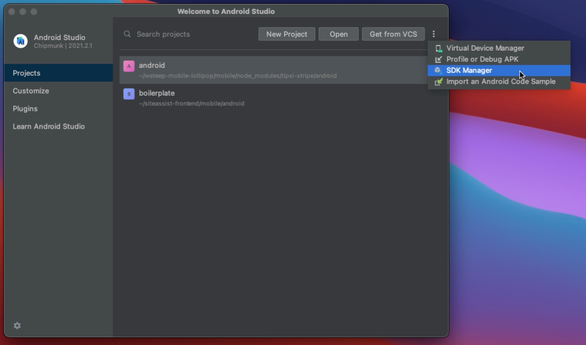
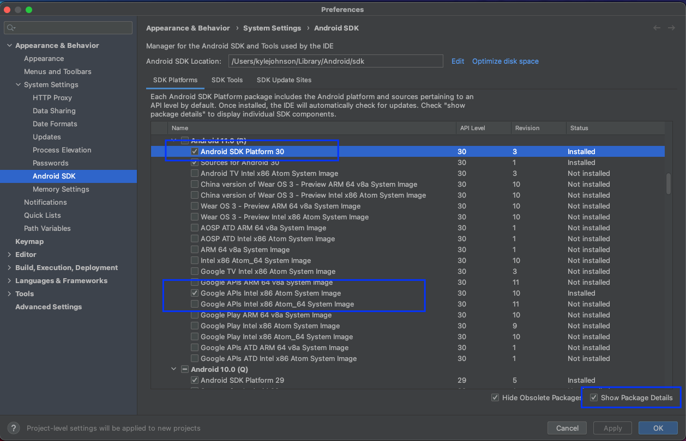
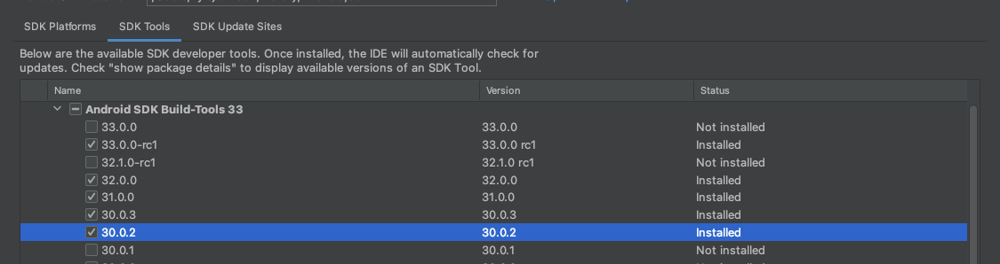
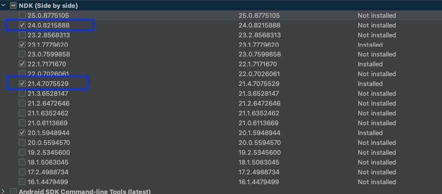
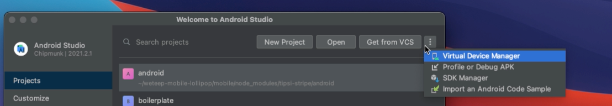
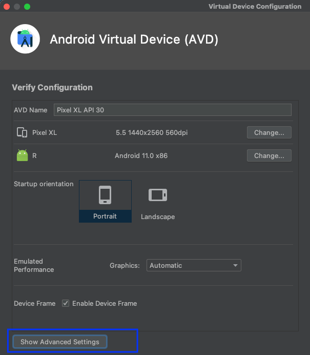
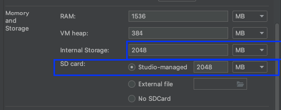
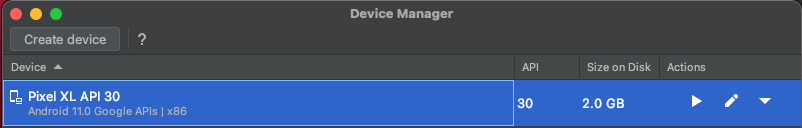

# Setup Android Environment
Once you have [Android Studio](https://developer.android.com/studio?gclid=CjwKCAjw3K2XBhAzEiwAmmgrAjN1PHIK0Qkxa9fR83LrMUx2dVWu2FqpLmJl1RBdPax_zhZfJRCgwxoCV7cQAvD_BwE&gclsrc=aw.ds) installed, you'll need to install a few things, go to SDK manager from the Android Studio Welcome Screen:

Click "Show Package Details" and install the following on an Android >= 12

- Android SDK Platform <NUMBER>
- for Apple M1 Silicon Google APIs ARM 64 v8a System Image (Or Google APIs Intel x86 Atom System Image for older)

In the SDK Tools tab, install the corresponding build tools (You need to tick show package details again)

In the SDK Tools tab, install the corresponding ndk listed in [build.gradle](/mobile/android/build.gradle#13)
- 24.0.8215888, 21.4.7075529

# Create an Android Emulator

Once you have [Android Studio](https://developer.android.com/studio?gclid=CjwKCAjw3K2XBhAzEiwAmmgrAjN1PHIK0Qkxa9fR83LrMUx2dVWu2FqpLmJl1RBdPax_zhZfJRCgwxoCV7cQAvD_BwE&gclsrc=aw.ds) installed, you'll need to install a few things, go to Virtual Device Manager from the Android Studio Welcome Screen:

Create a Device (any is fine), once you get to the following screen it's good to set storage to a higher amount than the default, 2048 is fine.

Once you've completed this you should see an emulator in your Device Manager, generally ``npm run android`` will launch this for you but you can open it manually here.

