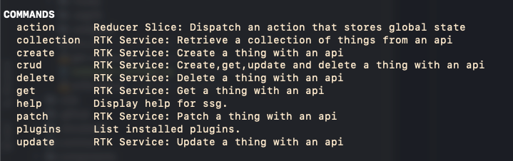
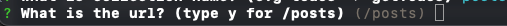
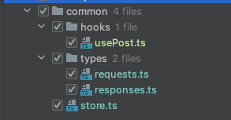
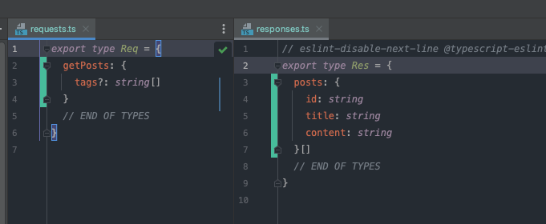

# SSG CLI

You can run the CLI from within a project

```shell
npx ssg help
```




If you run through the cli, it will essentially create a new hook that already has redux / api integration set up.

## Example: Get a collection of posts from /posts

**Step 1: Define the action**


**Step 2: Define the endpoint**

Note: The CLI will give you 2 default options, y for the pural (post becomes /posts) or exactly what you previously entered (post becomes /post)




This will output changes in the following files:



**Step 3: Define the request and response types**

Requests define what data to send to the api, responses define what data comes back from the api.

The following is an example of how we'd define the types for the request where we can query posts by an optional array of tags.




**Step 4: Using the hooks**

The hooks return a standard rtk query as well as specific functions to dispatch those actions (e.g. from SSR or manually to force refetch).


**Example get:**

```typescript
  const {
    data: postsData,
    isLoading: postsLoading,
    error: postsError,
  } = useGetPostsQuery({})


  console.log(postsData, postsLoading, postsError)

// or manually
  getPosts(getStore(), {})

```


**Example create (same goes for delete, update and patch):**

```typescript
  const [
  createPost,
  {
    data: createPostData,
    isLoading: createPostSaving,
    isSuccess: createPostLoaded,
    error: createPostError,
  },
] = useCreatePostMutation({})
console.log(createPost, createPostData, createPostSaving, createPostLoaded, createPostError)

// or manually
  getPosts(getStore(), {})

```


