The following guide tells you exactly how to get apps on beta and web deployed.

# Pre-requisites
- Create an organisation in Vercel (we can reuse ssg for PoCs)
- Create an organisation and android/ios projects in AppCenter
- Setup a repository on gitlab.com where your project will live
- Setup the environment variables

For the pipelines to work, the following is needed, you can look at the boilerplate for reference.

**Web**
- NOW_TOKEN: An access token with permissions on the organisation the website will build to, you can generate a token at https://vercel.com/account/tokens. We should encourage a client to generate one on their account.
- NOW_TEAM_NAME: the name of the Vercel team, this can be found in the URL e.g. https://vercel.com/solidstategroup

**Mobile**
- APPCENTER_ACCESS_TOKEN: An access token with permissions on the organisation the app will build to, you can generate a token at https://appcenter.ms/settings/apitokens. We should encourage a client to generate one on their account.
- APPCENTER_NAME_ANDROID_PRODUCTION: the full team/name of the android production App, can be pulled from the URL: https://appcenter.ms/orgs/Solid-State-Group/apps/Frontend-Boilerplate-Android -> Solid-State-Group/Frontend-Boilerplate-Android
- APPCENTER_NAME_IOS_PRODUCTION: the full team/name of the iOS production App
- CODE_PUSH_NAME_ANDROID: the full team/name of the App that contains code push builds (often the same as APPCENTER_NAME_ANDROID_PRODUCTION)
- CODE_PUSH_NAME_IOS: the full team/name of the App that contains code push builds (often the same as APPCENTER_NAME_IOS_PRODUCTION)

For the first build, you should comment out the mobile GitLab steps whilst you set up AppCenter.
You should get pipelines working even before the client sets up their Appstore/play store account, you can turn off signing for builds in AppCenter until then.

**AppCenter Setup**
You'll need to create an iOS and Android project in AppCenter and connect them to the relevant GitLab project. Ideally, the client has setup Appstore connect

Configure the master branch as follows:

**Configuration**

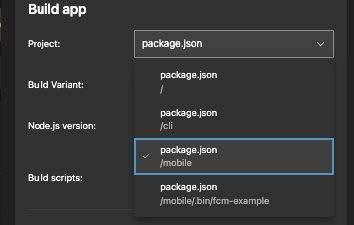
- Set the package.json to point to /mobile, this will determine which folder builds are attempted from.

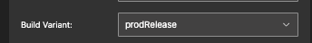
- For Android you need to select the build Variant, we are encouraging having only 1 app so this will almost always be prodRelease, if we have a test app it'll be uatRelease.

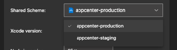
- For iOS you need to select a scheme, we are encouraging having only 1 app so this will almost always be app center-production, if we have a test app it'll be app center-staging.

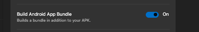
- For Android, App bundles are better than APKs due to compression, enable this option so that it can be submitted to the play store.

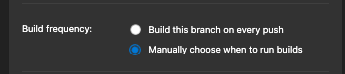
- Since we build from GitLab set the build frequency to manual

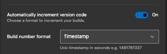
- Auto incrementing the build number based on timestamp is good.
 
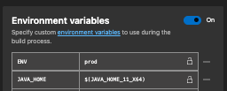
- Set ENV=prod to copy project_prod.js
- For Android, set JAVA_HOME = $(JAVA_HOME_11_X64) as a variable

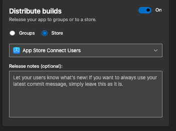
- For Android (You can skip this until client has setup play store)
  ``npm run android:keystore`` and follow the steps,

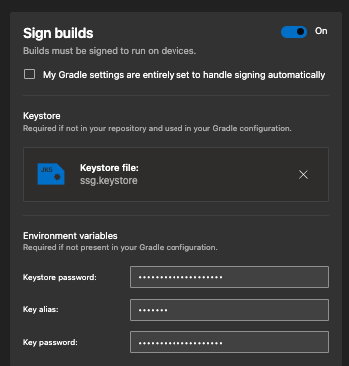
### Important: generate a strong password and put the keystore, alias and password into bitwarden. Losing a Keystore is not good.

# iOS Certificates

iOS signing consists of 2 things you'll need to create

- A distribution key, these can be Adhoc for installing to local devices or app store capable(you'll normally only care about these)
- A provisioning profile, these are tied to a distribution key and have capabilities e.g. push notifications

You can generate these at [https://developer.apple.com/account/resources/certificates/list](https://developer.apple.com/account/resources/certificates/list)

Once you've generated a certificate you'll need to open it in your keychain and then export **both the certificate and private key** into a p12 file.

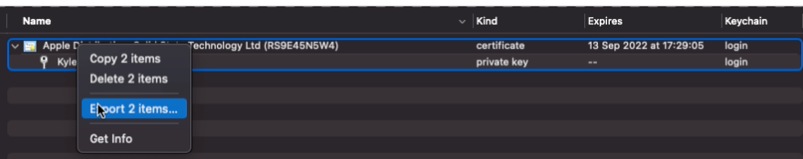

Having completed these steps your builds should look like the following:

**iOS**

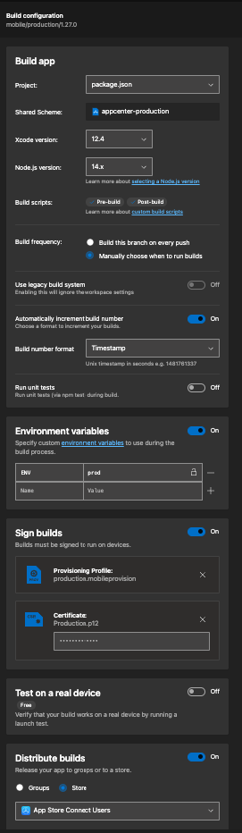

**Android**

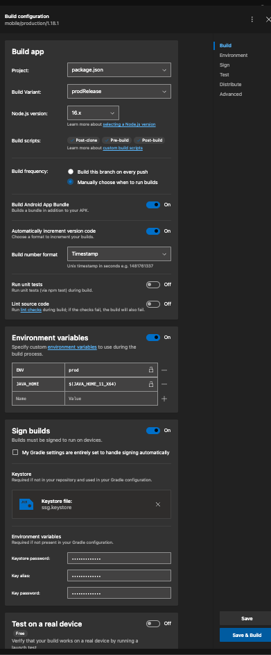
