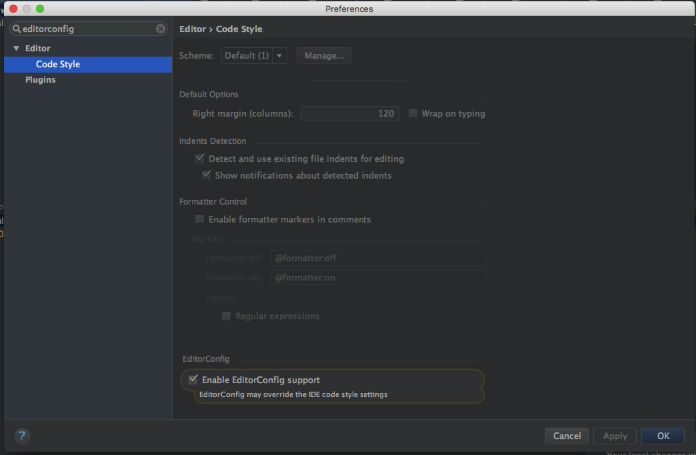

# React + Redux w/ ES6 Starter Project
A boilerplate using React, Flux, webpack + hot module reloading, and ES6 + JSX via Babel. Includes useful apis for getting started.

## Getting Started

### Installation Web
```
$ npm install
```

### Installation Mobile
```
$ cd ./mobile && npm install
// Add me to the top of RCTWebExecutor.m
#import "RCTBundleURLProvider.h"

//search for if (!host) and replace the code with the following
if (!host) {
      host = [[NSBundle mainBundle] objectForInfoDictionaryKey:@"SERVER_IP"];
}
```

## Useful mobile commands (paste these into ~/.bash_profile) 
- Display sha1 key for signing 
- run ios
- run android
- create an apk for android
```
alias andKey='keytool -list -v -keystore ~/.android/debug.keystore -alias androiddebugkey -storepass android -keypass android'

alias ios='react-native run-ios'

alias and='adb reverse tcp:8081 tcp:8081  && react-native run-android'

alias andDeploy='cd ./android && ./gradlew assembleRelease && ./gradlew installRelease && cd ../'
```

### iOS start
```npm run ios```

### Android start
```npm run android```

### Web start
```npm start```

### Prod build
* Build once for (ready for ***Production***):
  * `$ npm run prod` doing this will use project_dev | project_prod in place of your project.js file, minify / cachebust
  * Open `build/index.html` through the local webserver, the build folder can be deployed anywhere


## Routing
```routes.js``` contain all page routes

## How it all works
1. ```MemeComponent``` emits an action defined in ```app-actions``` (e.g. ```AppActions.sendMeme(url);``` after clicking a button)
2. ```app-actions.js``` takes the params along with an action type defined in action-constants (e.g. ```ActionConstants.SEND_MEME```)
3. ```meme-store.js``` picks up the action and calls events such as
    - store.loading()
    - store.change()
    - store.loaded()
    - store.saving()
    - store.saved()
4. Components listen to events and update state : ```this.listenTo(MemeStore, 'change', ()=>{this.setState({meme: MemeStore.model}})```

# APIS
## Modals
Globally accessible by default
* ```openModal(body, header, footer)```
* ```openConfirm(body, header, onYes, onNo)```

## Share (requires)
``import Share from 'apis/share/share'``
* ``Share.facebook(url)``
* ``Share.twitter(url)``

## Firebase auth - handles user management, fb/google/email based auth and profile data.

See https://github.com/SolidStateGroup/simple-firebase-auth or https://github.com/SolidStateGroup/react-native-firebase-auth

# Component Library - WEB
 **All components have prop types documented however for reference here they are**
## Forms

```<Button {... html button props}>``` 
- Standard button with btn className and blurs on mouseup

```<Input {... html input props} isValid={true|false} placeholderChar="-" mask="dd/mm/yy|"/>```  
-  Standard input with expanding hr on hover, allows input masks, validation and blurs on escape keypress

```<InputGroup inputProps{... Input props} onChange={func} title="" type="" placeholderChar="-" mask="dd/mm/yy|"/>```  
- Input wrapped in a form-group and label

**Tab component**
```
<Tabs value={this.state.tab} onChange={this.selectTab}>
        <TabItem tabLabel={(<div>Tab 1<span className="fa fa-phone tab-icon"/></div>)}>
            <h2>Tab 1 content</h2>
        </TabItem>
</Tabs>
``` 

## Grid
```<Flex>{content}</Flex>``` -- creates a div with flex:1

```<FormGroup>{content}</FormGroup>``` -- wraps content with margin bottom of ```$form-group-margin-bottom```

```<FormInline>{content}</FormInline>``` -- wraps content with form-inline class ```$form-group-margin-bottom```

```<Panel title="bla" icon="bla"> <div/></Panel>``` - creates a panel with a heading and content 

```<Row space={true}><div>item1</div><div>item2</div></Row>``` - creates flex row with the option to space items to extreme ends of the row 

## Addons - these require you to import the files explicitely

### autocomplete that can either be inline or displayed as a popover with the absolute property

```
 <AutoComplete ref="autocomplete"
        inputProps={inputProps}
        onChange={this.search}
        onSelect={this.selectRow}
        renderRow={this.renderRow}
        isAbsolute={this.state.isAbsolute}
        data={this.state.data}
        //optional
        inputProps{... Input Props}
        renderNoResults={'No results sorry'}
        rowHeight={40}
        containerHeight={200}
        />
```  


``` 
-- render a big list of data, calls loadMore when you scroll to the threshold
<InfiniteScroll
    isLoading={true}
    loadMore={this.loadPage}
    scrollToRow={50}
    renderLoading={<span>Loading</span>}
    renderRow={this.renderRow}
    data{[]}
    containerHeight={200}
    rowHeight={40}
    threshold{50}
    />
```

**Highlighter- splits text into renderText and render highlight e.g *test***icle
``` 
<Highlighter search="test" value="testicle"  
    //optional
    renderText={(nonMatchingText))=>(<span>{nonMatchingText}</span>)}
    renderHighlight={(matchingText))=>(<bold>{matchingText}</bold>)}
    />
``` 

**ListView- Renders a performant list view, only rendering items that it needs to**
``` 
<ListView 
        data={[]}
        rowHeight={40}
        containerHeight={200}
        renderRow={this.renderRow}    
        renderNoResults={<span>NoResults</span>}    
    />
```

**StarRating- Simple star rating component**
```
<StarRating value={2} icon="star" max={10} editable="true" onChange={this.onChange}/>
```


#Advanced - Higher order components
**These are less about markup, they provide functionality to child components**

**FocusMonitor - Calls back when the whole element and its children's focus has changed**

```<FocusMonitor onFocusChanged={this.focusChanged}>{stuff}</FocusMonitor>``` 

**InputStepper - Calls back when the whole element and its children's focus has changed**
```<InputStepper data={[]} onChange={this.selectedItemChanged} 
        inputProps={... inputProps}>{(selectedRow, highlightRow)=>(<div>The selected element is {selectedRow}</div>)}</InputStepper>``` - creates an input that tracks up and down keystrokes against a collection of elements
        
        
        
## Further Information

The provided boilerplate enables client-side ES6 via the following technologies:

- [webpack](http://webpack.github.io/) and [webpack-dev-server](https://webpack.github.io/docs/webpack-dev-server.html) as a client-side module builder and module loader.
- [npm](https://www.npmjs.com/) as a package manager and task runner.
- [Babel](http://babeljs.io/) 6 as a transpiler from ES6 to ES5.
- [React](https://facebook.github.io/react/) and [JSX](https://facebook.github.io/jsx/) as a virtual Dom JavaScript library for rendering user interfaces (views).
- [ESLint](http://eslint.org/) as a reporter for syntax and style issues. [eslint-plugin-react](https://github.com/yannickcr/eslint-plugin-react) for additional React specific linting rules.
- [Sass](http://sass-lang.com/) as a compiler of CSS styles with variables, mixins, and more.
- [Mocha](https://mochajs.org/) as a test framework.
- [Chai](http://chaijs.com/) as a BDD assertion library that works along with `Mocha`.

When you run `npm start`:

 1. The sass-loader compiles Sass into CSS
 2. Webpack bundles the compiled CSS into app.js. Sounds weird, but it works!
 3. app.js contains code that loads styles into the &lt;head&gt; section of index.html via JavaScript. This is why there is no stylesheet reference in index.html. In fact, if you disable JavaScript in your browser, you'll see the styles don't load either.

The approach above supports hot reloading, which is great for development. However, it also create a flash of unstyled content on load because you have to wait for the JavaScript to parse and load styles before they're applied. So for the production build, we use a different approach:

When you run `npm run prod`:

 1. The sass-loader compiles Sass into CSS
 2. The [extract-text-webpack-plugin](https://github.com/webpack/extract-text-webpack-plugin) extracts the compiled Sass into app.css
 3. buildHtml.js adds a reference to the stylesheet to the head of index.html.

## Updating npm packages
This is very useful to keep the boilerplate up to date, the following will update your ```package.json``` to use latest compatible packages
* ```npm install -g npm-check-updates```
* ```ncu -u```

### If you're getting issues with conflicting code styles (e.g. tab indentation)
This standardises code styles and prevents any nasty merge issues caused by differing editor configs



## Fixing lint issues
This is useful to fix simple js linting issues
* ```npm run fix```


